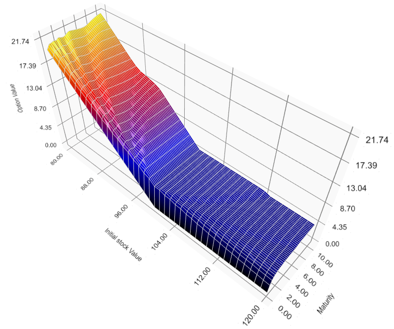

Numerical scheme for Dynkin games under model uncertainty

We introduce an efficient numerical scheme for continuous time Dynkin games under model uncertainty. We use the Skorokhod embedding in order to construct recombining tree approximations. This technique allows us to determine convergence rates and to construct numerically optimal stopping strategies. We apply our method to several examples of game options.

This is a GUI that let the user to price options under volatility uncertainty.
If the type option is not implemented, then the user can write in a c++ fashion the payoff and the type of option (Russian, parisian, asiat. etc)

Download here : https://drive.google.com/drive/folders/1s-W_Q1nixBkgU0wbY9oxJqVMN67huMfi?usp=sharing

